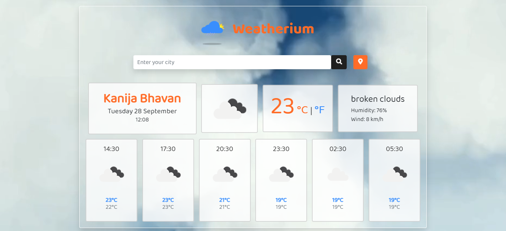

# Weatherium
  *Made with vanilla JS using Open Weather API*

### Check it out [here]!
 

 [here]:<taheermattur.github.io/weatherium/>

## Overview 👀

 - A weather app that uses Open Weather API to grab the weather of the city
 - It also uses Weather forecast for the next 18 hours
 - Uses of Geo-Location browser API to fetch the current location of the user
 - Frontend made with Bootstrap-4.6
 - Completely responsive, works on any devices
 - Glassy finish for screens >=992px
 - Additionally it has a video background of clouds >=992px
